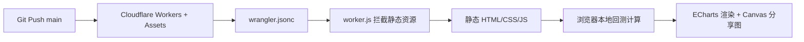

# 恒市值助手

[](https://workers.cloudflare.com/)
[](https://developer.mozilla.org/)
[](https://echarts.apache.org/)
[](./LICENSE)

不盯盘、不择时、每月 5 分钟。一套用 11 年真实市场数据验证的资产配置策略，把"恒市值法"做成可交互、可回测、可分享的网页工具。

- 在线地址：<https://h.sugas.site/>
- GitHub Pages 镜像：<https://xp13465.github.io/hdszf/>

---

## 目录

- [这是什么](#这是什么)
- [核心特性](#核心特性)
- [三档方案速览](#三档方案速览)
- [恒市值法原理](#恒市值法原理)
- [技术架构](#技术架构)
- [本地运行](#本地运行)
- [部署到 Cloudflare](#部署到-cloudflare)
- [回测方法论](#回测方法论)
- [开发约定](#开发约定)
- [已知限制](#已知限制)
- [风险提示与免责声明](#风险提示与免责声明)
- [贡献](#贡献)
- [许可证](#许可证)

---

## 这是什么

恒市值助手是一个**纯前端**的资产配置回测工具。用户输入各资产比例（或采用预设方案），工具用 2015 年 8 月至 2026 年 7 月共 131 个月的真实收益数据，模拟"恒市值法"月度再平衡后的长期表现，输出年化、回撤、Sharpe、Sortino、月胜率等指标，并生成可分享的宣传海报。

目标用户是认可"纪律化再平衡、放弃择时"理念的普通投资者，把抽象的资产配置策略变成看得见、算得清、能落地的操作方案。

---

## 核心特性

- **六类资产覆盖**：沪深 300、中证 500、标普 500、纳斯达克 100、黄金、现金·货币基金，跨 A 股、美股、商品、现金。
- **三档预设方案**：保守型、稳健型、进取型，一键切换；稳健型经 10 年（2016 到 2025）验证为 8 赚 2 亏，最差年份仅 -3.7%。
- **交互式滑块**：实时拖动配置，引擎即时回测，缺额自动归入现金·货币基金（用户无感）。
- **多维图表**：收益/回撤曲线、五维雷达图、方案对比柱状图、配置饼图，基于 ECharts 5.5。
- **三套主题**：商务风（藏蓝+暖金）、现代风（绿+白）、科技风（深蓝+青绿），URL 参数 `?theme=business|modern|tech` 可锁定。
- **分享海报**：Canvas 逐像素绘制含站点二维码的竖版海报，适配朋友圈、小红书、微博。
- **SEO 完整**：JSON-LD 结构化数据、OG/Twitter Card、sitemap、robots，静态 SEO 文案对爬虫可见。
- **零后端依赖**：全部计算在浏览器完成，无服务器、无数据库、无隐私上传。

---

## 三档方案速览

以下为 50 万本金、恒市值法月度再平衡（±5% 阈值、0.1% 费率）的历史回测结果，数据来源见[回测方法论](#回测方法论)。

| 方案 | 年化收益 | 最大回撤 | Sharpe | Sortino | 终值（50 万起） | 月胜率 |
|---|---|---|---|---|---|---|
| 保守型 | 5.60% | -3.53% | 1.41 | 2.07 | 90.7 万 | 73.3% |
| **稳健型** | **7.60%** | **-6.09%** | **1.25** | **1.66** | **111.2 万** | **67.9%** |
| 进取型 | 11.67% | -10.17% | 1.18 | 1.96 | 166.8 万 | 65.6% |

稳健型资产配置：沪深 300 占 15%、中证 500 占 5%、标普 500 占 15%、纳斯达克 100 占 20%、黄金占 20%、现金·货币基金占 25%。

> 数据出处：项目内 `PROJECT_SPEC.md` 第九章与 `CODEBUDDY.md` 第三章，均基于真实历史数据计算。

---

## 恒市值法原理

恒市值法（Constant Market Value）为组合中每个资产设定**固定目标市值**，例如黄金始终维持 10 万元，不随总市值涨跌而变动。每月检查实际市值，偏离目标超过 ±5% 即调仓回到目标。

现金在其中扮演"吸收池"角色：卖出资产回流的现金、买入资产扣除的现金，都经由它结算。

该方法的逻辑与恒定比例法不同。恒定比例法让目标权重随总市值浮动，恒市值法让目标市值固定，因此再平衡动作天然带"高抛低吸"属性，长期熨平波动。

收益来自两点：跨资产分散降低波动，以及纪律化再平衡捕获均值回归。代价是满仓运行、放弃现金择时，在单边长牛中跑输买入持有。这是设计取舍，不是缺陷。

---

## 技术架构

### 部署链路



### 技术栈

- 前端：原生 HTML / CSS / JavaScript（无框架、无构建步骤）
- 图表：ECharts 5.5
- 二维码：qrcode-generator 1.4.4（本地 vendor，免 CDN 依赖）
- 部署：Cloudflare Workers + Assets（`wrangler.jsonc`），推送即自动发布
- 预览：Python 标准库 `http.server`

### 文件结构

```
hdszf/
├── index.html              # 主页面，含跨皮肤内联 <style>
├── worker.js               # Cloudflare Worker，拦截静态资源设缓存头
├── wrangler.jsonc          # 部署配置（Worker 名称 hdszf + Assets 绑定）
├── _headers                # 响应头规则
├── css/
│   ├── style.css           # 商务风（默认）
│   ├── modern.css          # 现代风
│   └── tech.css            # 科技风
├── js/
│   ├── data.js             # 核心数据（131 个月收益、基金净值、三档对比）
│   ├── engine.js           # 主回测引擎（trendData 预计算插值）
│   ├── rolling.js          # 滚动回测引擎（逐月真实回测，无前视偏差）
│   ├── charts.js           # ECharts 图表管理
│   ├── sliders.js          # 滑块交互
│   ├── share-image.js      # 分享海报生成
│   ├── main.js             # 主入口（渲染、事件、授权弹窗、主题切换）
│   ├── real_returns.json   # 真实月度收益数据
│   └── vendor/qrcode.min.js
├── images/                 # douyin-card.jpg、og-preview.png
├── scripts/generate_og_image.py  # OG 预览图生成（Python + Pillow）
├── 恒市值法理财操作表（稳健型）.xlsx  # 下载用 Excel
├── sitemap.xml / robots.txt
├── CODEBUDDY.md            # 项目记忆与开发上下文
└── PROJECT_SPEC.md         # 完整项目规范
```

---

## 本地运行

无需安装依赖，任意静态服务器即可：

```bash
# 在项目根目录执行
python3 -m http.server 8080

# 浏览器打开
open http://localhost:8080
```

指定主题预览：`http://localhost:8080/?theme=tech`

---

## 部署到 Cloudflare

本项目已配置 `wrangler.jsonc`，`assets.directory` 指向仓库根，`run_worker_first: true` 让 Worker 优先于静态资源执行。

```bash
# 安装并登录
npm install -g wrangler
wrangler login

# 部署
wrangler deploy
```

推送 `main` 分支后，Cloudflare 自动执行 `wrangler deploy`，通常数分钟内生效。也可使用 GitHub Pages、Vercel、Netlify 等静态托管，详见 `部署指南.md`。

---

## 回测方法论

### 数据来源

- 月度收益：新浪财经前复权 K 线（2015-08 至 2026-07，共 131 个月）
- 基金净值：天天基金网 API（13 只基金，约 35,784 条记录）
- 处理：前复权含分红再投资；货币基金用万份收益折算日收益；同类多基金按规模加权合成；QDII 按 3% / 8% 分档计溢价

### 回测参数

初始资金 50 万、再平衡阈值 ±5%、交易费率 0.1%、建仓期 1 个月（一次）或 12 个月（分批）、无风险利率 2%。

### 指标公式

- 年化收益（CAGR）：`(终值 / 初值)^(1 / 年数) - 1`
- Sharpe：`(年化 - 0.02) / 年化波动率`
- Sortino：`(年化 - 0.02) / 下行波动率`（仅负收益标准差）
- 最大回撤：峰值追踪法

### 两种引擎

- `engine.js`：基于预计算 `trendData`（约 205 条）做 6 维欧氏距离最近邻插值，速度快，但存在轻微前视偏差风险。
- `rolling.js`：逐月真实回测，无前视偏差，结果可审计，用于校验。

---

## 开发约定

- **资产命名一致**：六类资产中文名在 `data.js`、`engine.js`、`sliders.js`、`charts.js`、`index.html` 中必须完全相同，尤其"现金·货币基金"不可简写为"现金"，否则匹配失败。
- **版本号递增**：每次修改 CSS/JS，需在 `index.html` 引用处与 `main.js` 的 `themeMap` 同步递增内联版本号（如 `v=18` 升 `v=19`），用于绕过 CDN 缓存。
- **三主题同步**：新增弹窗、表格等跨皮肤组件样式，必须同时写入 `index.html` 内联 `<style>` 块，否则非默认主题下不可见。
- **图表注册**：新增 ECharts 容器需在 `main.js` 的 `chartIds` 数组登记，主题切换时才能正确重建。
- **提交信息**：使用中文描述改动内容。

---

## 已知限制

以下问题客观存在，使用前请知悉：

- **前视偏差风险**：`engine.js` 主引擎依赖预计算插值，与 `rolling.js` 逐月回测结果可能有微小偏差；三档方案已注入精确匹配以保证一致。
- **滑块总和锁定 100%**：这是满仓再平衡的刻意设计，调整单项会等比例缩放其余资产，因此"减现金"不等于"加活期"，而是把现金份额重新分配到其他资产。
- **CDN 缓存延迟**：站点经毛子云 CDN（默认 `max-age=1200`，约 20 分钟）后再到 Cloudflare，代码推送后最多需 20 分钟用户才能看到更新。
- **数据缺口**：2026-07 无真实数据，使用均值估计；部分 ETF（红利 ETF、国债 ETF）尚未纳入基金池。
- **费用简化**：0.1% 费率未计入 ETF 滑点与冲击成本，极端行情下实际表现可能更弱。

---

## 风险提示与免责声明

本工具仅用于策略演示与投资教育，**不构成任何投资建议**。

历史回测基于过去市场数据，不代表未来收益。任何投资都有本金亏损风险，资产配置不能消除风险，只能改变风险的结构与分布。请在独立判断、并咨询持牌专业人士后做出决策。作者与本项目不对任何依据本工具做出的投资行为承担责任。

---

## 贡献

欢迎提交 Issue 与 Pull Request。提交前请确认：

- 六类资产命名在所有文件中一致
- 新增图表已在 `main.js` 的 `chartIds` 登记
- 修改 CSS 变量时已同步三个主题文件
- 改动 CSS/JS 后内联版本号已递增
- 用 `node --check` 验证 JS 语法

---

## 许可证

本项目以 MIT 许可证开源，详见 `LICENSE` 文件。

理财操作表、分享素材等数据文件版权归原作者所有，仅随项目分发用于个人学习。
